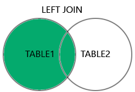

# SQL im Kurs Dozent: P.B.

# Einleitung
Einfaches Beispiel:

````sql
SELECT Artikel.Name, Artikel.Beschreibung
FROM Artikel
WHERE Artikel.ArtikelID LIKE '123%' ORDER BY Artikel.Länge DESC;
````

## abstract
````
SELECT ...  
FROM ...  
    WHERE ...  
    GROUP BY ...  
    HAVING ...  
    ORDER BY ...  
    LIMIT   
````
## Wildcards in SQL mit "like"
ein beliebiges Zeichen: _
mehrere beliebige Zeichen: %

Zum Üben der ersten Grundlagen :)  
Notiere dir deine Spiel-ID: bQYYg51yfM

https://sql-island.informatik.uni-kl.de/

# Different Types of SQL JOINs

(INNER) JOIN: Returns records that have matching values in both tables


LEFT (OUTER) JOIN: Returns all records from the left table, and the matched records from the right table



RIGHT (OUTER) JOIN: Returns all records from the right table, and the matched records from the left table


FULL (OUTER) JOIN: Returns all records when there is a match in either left or right table


´´´´
Es gibt noch ein paar mehr Joinarten jedoch werden diese nicht geprüft.
´´´´

# Benötigte Typen
- Kardinalität: n -> innerJoin
- Kardinalität: 1 -> leftJoin wenn NULL-Werte gezeigt werden sollen

# Structured Query Language
DML -> Data Manipulation Language
- INSERT -> einfügen eines oder mehrerer Tupel
- DELETE -> Löschen eines o. m. Tupel
- UPDATE -> Änderung innerhalb eines o. m. Tupel

DCL -> Data Control Language
- GRANT -> Recht erteilen an einer Tabelle oder DB
- REVOKE -> Recht entfernen

DDL -> DataDefinitionLanguage
- CREATE -> erstellt Datenbanken und Tabellen
- DROP -> Löscht DB's und Tabellen
- ALTER -> ändert DB'S und Tabellen (Foreign Key)

DQL -> DataQueryLanguage
- SELECT -> Aufruf eines oder mehrerer Tupel (Datensatz auch Zeile genannt)
- SHOW -> zeigt die Definition von DB's und Tabellen an
- HELP -> Ruft die Hilfe auf

# TODO: SQL Übungen

TODO: SQL Aufgaben suchen und üben ggf. ki generierte Aufgaben

Aufgabe d: Geben Sie alle SQL-Anweisungen an, welche notwendig sind, um einen neuen Nutzer: "Maier" mit dem Passwort: "5jk2T?" zu erstellen und diesem die Leserechte an der Tabelle: Objekt geben.
````SQL
CREATE USER 'Maier' IDENTIFIED BY '5jk2T?';
GRANT SELECT ON Objekt TO 'Maier';
````
