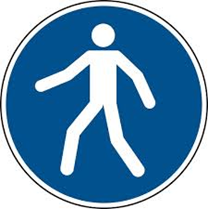
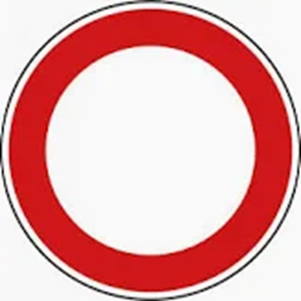

# Kursprotokoll
15.09.2025 - Montag
- Überlick und Ablauf der Prüfungen und Projektabrbeit
- http://caesborn.de/pruefungspage/index.html
- Probeklausur
16.09.2025 - Dienstag
- WISO Übungen
    - Rahmenlerhpläne, individuelle Lehrpläne
    - Übungsprüfungsfragen und Hintergründe
    - 0.Normalisierung

# Themen und Anmerkungen
## Punkte der schriftlichen Prüfung
Gesamt: 300 Punkte
- Punktespender:
    - WISO: 70-80
    - Datenbanken und Normalisierung und SQL: 50
    - Projektmanagement: 25
    - Programmierung: 20-35
    - UML: ca.40 (Sequenzdiagramm kommt öfters)

# WISO

## Probezeiten
- Arbeitnehmer kann Probezeit haben: 0-6 Monate
- Probezeiten in der Ausbildung: 1-4 Monate

## Rechtsformen BGB -> Bürgerliches Gesetzbuch
Gesellschaft bürgerlichen Rechts - GbR
- vieles kann, fast nichts muss

## Rechtsformen HGB -> Handelsgesetzbuch

### Abteilung A: Personengesellschaften

Eingetragene Kaufmann/-frau (Ist-Kaufmann)
- Haftet für alles
- Gewinn allein für sich selbst

Kommanditgesellschaft
- Komplementär (haftet für alles, ist alleine Verantwortlich)
- Kommanditist (haftet mit Einlage, hat nix zu sagen)
- Gewinn: 4% Kapitalverzinsung + Rest in angemessenem Verhältnis

Offene Handelsgesellschaft
- Haftung: jeder für alles
- Gewinn: 4% Kapitalverzinsung + Rest nach Köpfen 

Kann-Kaufmann
- auch Minderkaufmann, z. Bsp. ungelernter Kioskbetreiber
- bis 600.000,- Umsatz
- einfache Buchführung

Eingetragene Genossenschaft
- TODO: k.a.

### Abteilung B: Kapitalgesellschaften

### GmbH - Gesellschaft mit beschränkter Haftung
#### Haftung der GmbH
- Gesellschaftsebene: Die GmbH haftet ausschließlich mit ihrem Gesellschaftsvermögen für Verbindlichkeiten.
- Gesellschafter: Die Gesellschafter haften nicht persönlich, sondern nur mit ihrer Einlage (mindestens 25.000 Euro Stammkapital).
- Geschäftsführer: Können unter bestimmten Umständen persönlich haften, z. B. bei Pflichtverletzungen, Insolvenzverschleppung oder Steuervergehen
#### Sonstiges GmbH
- Gewinn: Gesellschafter nach Gesellschaftervertrag
- Mindesteinlage: € 25000,-
- Geschäftsführer/in
- Oberstes Organ: Gesellschafterversammlung

### Aktiengesellschaft
#### Haftung der AG
- Gesellschaftsebene: Auch die AG haftet nur mit ihrem Gesellschaftsvermögen.
- Aktionäre: Haften ebenfalls nicht persönlich, sondern nur mit dem Betrag, den sie für ihre Aktien bezahlt haben.
- Vorstand und Aufsichtsrat: Der Vorstand kann bei Pflichtverletzungen haftbar gemacht werden, z. B. bei Missmanagement oder Verletzung der Sorgfaltspflicht. Der Aufsichtsrat haftet bei unterlassener Kontrolle
#### Sonsitges AG
- Gewinn: Dividende - Entscheidung durch Hauptversammlung
- Hauptversammlung wählt den Aufsichtsrat:
    - Überwacht Vorstand, bestellt Vorstand und kann diesen auch rausschmeißen
- Vorstand leitet Unternehmen
- € 50000,-
- Oberstes Organg: Hauptversammlung

### Societas Europaea, kurz SE
- 120.000,-
- Wie AG
- Hauptsitz in EU frei wählbar

### GmbH & Co. KG oder SE & Co. KG
Die Kommanditgesellschaft (KG) ist eine Personengesellschaft mit zwei Arten von Gesellschaftern:

- **Komplementär:** Voll haftender Gesellschafter (persönlich und unbeschränkt).
- **Kommanditist:** Haftet nur mit seiner Einlage.

Das Problem: Der Komplementär haftet mit seinem gesamten Privatvermögen. Um das zu umgehen, wird oft eine Kapitalgesellschaft als Komplementär eingesetzt – und genau hier kommen GmbH & Co. KG und SE & Co. KG ins Spiel.

#### Beispiel: GmbH & Co. KG
- **Komplementär:** Eine GmbH übernimmt die Rolle des voll haftenden Gesellschafters.
- **Kommanditisten:** Natürliche oder juristische Personen, die nur mit ihrer Einlage haften.
- **Haftung:** Die GmbH haftet als Komplementär – aber da sie selbst eine Kapitalgesellschaft ist, haftet sie nur mit ihrem Gesellschaftsvermögen. Die natürliche Person hinter der GmbH haftet nicht persönlich.
**Vorteil:** Volle Haftungsbegrenzung bei gleichzeitiger Flexibilität der KG-Struktur.

#### Beispiel: SE & Co. KG
- **Komplementär:** Eine SE (Societas Europaea) übernimmt die Rolle des Komplementärs.
- **Kommanditisten:** Wie bei der GmbH & Co. KG.
- **Haftung:** Auch hier haftet die SE nur mit ihrem Gesellschaftsvermögen.

**Vorteil:** Internationale Ausrichtung und EU-weite Mobilität. Die SE ist eine europäische Kapitalgesellschaft, die grenzüberschreitend agieren kann.

## Arbeitnehmerrechte
Darauf aufbauhend und nie schlechter:
1. Gesetzliche Grundlage ->
2. Manteltarifvertrag (10 Jahre) ->
3. Tarifvertrag(Lohn- und Gehalt, 1-2 Jahre) ->
4. Betriebsvereinbarung ->
5. Einzelarbeitsvertrag

## IHK-Bedingte Gesellschaftsformen
- Ein-Linien-System
- Mehrlinien-System
- Matrixsystem
- Ein-Linien mit Stabstellen

# Marktformen
|                   | ein Nachfrager |  wenige Nachfrager | viele Nachfrager |
|-------------------|----------------|--------------------|------------------|
| ein Anbieter      | zweiseitiges Monopol          | beschränktes Angebotsmonopol| Monopol|
| wenige Abieter    | beschränktes Nachfragemonopol | zweis. Oligopol | Oligopol |
| viele Anbieter    | Nachfragemonopol              | Nachfrageoligopol | Polypol |

## Vollommener Markt
Einfaches Modell von Menge zu Preis bei ggb. linearem Angebot und lineare Nachfrage
Verkäufermarkt vs. Käufermarkt

# Beitragsbemessungsgrenze in der gesetzlichen Rentenversicherung
- 5 sozial Verischerungen werden vom Brutto-Gehalt abgezogen
- Sozialversicherungen
    - Arbeitnehmeranteil
    - Arbeitgeberanteil
- Beitragsbemessungsgrenze in der Rentenversicherung: Höchstbeitrag
- ca. 20% Sozialabgaben auf Grundlage des sozialversicherungspflichtigen Bruttoeinkommens.

## Sozialversicherungszweige Beispielverteilung
|Sozialversicherungszweige       | Arbeitnehmeranteil           | Arbeitgeberanteil             |
|--------------------------------|------------------------------|-------------------------------|
| Rentenversicherung             |18,6% -> AN 50% (9,3%)        | AG 50 % (9,3%)                |
| Krankenversicherung            |14,6 % + Anteil KK -> AN 50 % (7,3% + x%)| AG 50% (7,3%+x%)   |
| Arbeitslosenversicherung       |2,6% -> AN 50% (1,3%)         |2,6% -> AG 50% (1,3%)          |
| Pflegeversicherung             | extra geregelt, nach Kindern |extra geregelt gem. trallala   |
| Gesetzliche Unfallversicherung |   x% -> AN 0 %               | AG 100%                       |

## Lohnersatzleistungen (steuerfrei)
- ALG 1
- Elterngeld
- Förderung zur Umschulung
- Kurzarbeitergeld

Lohnerstzleistungen sind steuerfrei, jedoch gibt es den Progressionsvorbehalt seitens der Finanzämter.

Beim Progressionsvorbehalt werden alle Einkommen des Jahres zur Ermittlung des Steuersatzes herangezogen,
der höhere Steuersatz wird dann auf die zu besteuerenden Einkommen angewand.

# Wirtschaftlichkeit
Wirtschaftlichkeit = Ertrag / Aufwand

# BAP - Bildschirmarbeitsplatz
- Arbeitsplatzleuchten
- Lamellen zur Lichtregulierung
- BAP- Raumleuchte
- PC + Monitor mit Maus und Tastatur
- Scanner
- Drucker
- Schreibtisch
- Stuhl mit mindestens 5 Rollen
- Tischplattenhöhe: 72cm
- Tastatur mit rechtem Winkel gebeugten Armen bedienbar
- Monitor zu Gesicht-Abstand 40cm bis 80cm und der obere Bildschirmrand sollte auf Augenhöhe sein

# Kennzeichnungen am Arbeitsplatz
## Gebotsschild

## Rettungsschild

## Verbotsschild

## Warnhinweis

# Anhang: i
## WiSo Winter 24/25 (selbst, ohne Gewehr)
1. 5
2. 4
3. 1
4. 3
5. 3
6. 3
7. 3, 4
8. 1
9. 5
10. a – 2; b – 1; c – 4
11. (3) 5
12. 1
13. 2
14. 5
15. 5
16. 2
17. 5
18. a – 3;  b – 2; c – 3; d – 1; e – 1
19. 5
20. 3
21. 4
22. 3
23. 1
24. 2
25. 3
26. 2
27. 2, 5
28. 1, 5
29. 3
30. 2

## WiSo Sommer 24 (selbst, ohne Gewehr)
1. 4
2. 2
3. 3
4. 2
5. 1, 4
6. 2
7. 4
8. 2
9. 3,4
10. 3
11. 1, 3
12. 3
13.
    a- 3
    b- 4
    c- 5
    d- 1
    e- 2
14. 3
15. 4
16. 34.980,00
17. 3
18. 8
19. 5
20. 3
21. 1
22. 2
23. 4
24. 4
25. 1
26. 4
27. 4
28. 5
29. 3, 5
30. 4

## WiSo Winter 22/23 (selbst, ohne Gewehr)
TODO